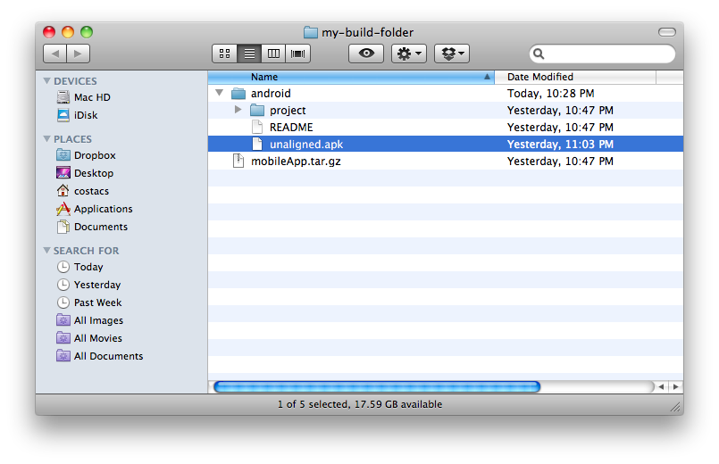
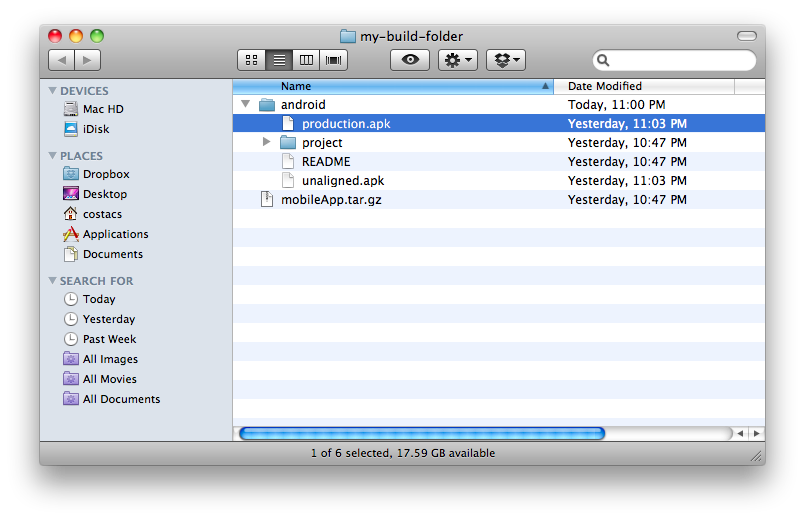

# countrer
*Εφαρμογή υδρομέτρησης με τη χρήση κινητού τηλεφώνου (android)*

Αναλυτική περιγραφή στο [wiki](https://github.com/ellak-monades-aristeias/counter/wiki) .

## software stuck

To project ειναι βασισμένο αποκλειστηκα στο [Meteor](https://www.meteor.com/) JavaScript App Platform

## Prerequisites

* [Git](http://git-scm.com/book/en/v2/Getting-Started-Installing-Git)
* [Meteor](https://www.meteor.com/install)

## Installation

clone this repo:

```sh
git clone https://github.com/ellak-monades-aristeias/counter.git
cd counter
```
## Run the web application

* change directory into webApp and create a file settings.json
* open the file example.settings.json and copy it's contents into the settings.json file you just created.
Replace the example values with your own.
* Now run the app like this:

```sh
meteor run -p 4444 --settings settings.json
```
Open a browser and navigate to [http://localhost:4444](http://localhost:4444) .

## Run the mobile application

* Make sure the device is connected to your computer via USB cable.
* Connect the device to a wifi network that allows communication with the application server.
* Make sure your device is set up for development as explained [here](http://developer.android.com/tools/device.html#setting-up)
* Change directory into mobileApp
* Run the app with:

```sh
meteor run android-device --mobile-server=http://192.168.1.1:4444
```

## Deploy the web application

To deploy the web app cd to the webApp directory and run:

```sh
meteor deploy nameofyourapp.meteor.com
```

For deployment to your own server the simplest way is to use [mup](https://github.com/arunoda/meteor-up).

## Build the android application

From within the mobileApp directory run:

```sh
meteor build --server=http://nameofyourapp.meteor.com ../my-build-folder
```

The build folder looks this



Now you must sign your application bundle or apk file.
First create a key. This key is essential and you mustn't lose it. If the key is lost, you will then lose the ability to publish updates! Create a key via the shell command:

```sh
keytool -genkey -alias counter-app -keyalg RSA -keysize 2048 -validity 10000
```
Back up the cert file using the command:

```sh
keytool -exportcert -alias counter-app -file counter.cer
```

Next step is to sign the unaligned application file. In the build folder you can find a file named unaligned.apk. This needs to be signed. Open a shell and cd to the build directory. The command used for signing the apk-file is: 

```sh
jarsigner -digestalg SHA1 unaligned.apk counter-app
```

Once the file is signed, it needs to be aligned. Do that by issuing

```sh
 ~/.meteor/android_bundle/android-sdk/build-tools/21.0.0/zipalign 4 unaligned.apk production.apk
 ```

 Now in your build folder you have a new file production.apk.



This is the file you should submit to the Play Store or send it any other way in your android devices.

